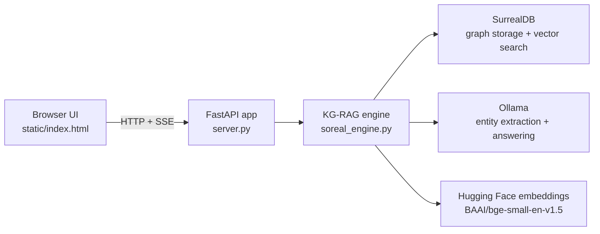

# Soreal Architecture

## Summary

Soreal is a legal-document knowledge-graph RAG application with a Docker-first local runtime. The maintained app is a FastAPI service that serves a single static frontend, stores graph data in SurrealDB, and uses Ollama plus Hugging Face embeddings to ingest documents and answer questions.

The runtime is centered on two Python modules:

- `server.py`: HTTP layer and session handling
- `soreal_engine.py`: schema, tools, LangGraph workflow, retrieval, and groundedness logic

## Runtime topology

Container layout in the maintained runtime:

- `app` exposes `8001`
- `surrealdb` exposes `8000`
- `ollama` exposes `11434`

`docker/wait_for_services.py` blocks app startup until SurrealDB is reachable and the Ollama HTTP API responds.

## Ingest flow

`POST /api/analyze` starts the full document-ingestion pipeline and streams progress back as server-sent events.

1. `server.py` validates `AnalyzeRequest.text` and starts a streaming response.
2. `soreal_engine.ingest_document()` verifies the Ollama API and model, then resets the database and reinitializes the schema.
3. The LangGraph workflow routes the request into the ingest path.
4. `ingest_text()` splits the document into overlapping chunks and stores chunk records with embeddings in SurrealDB.
5. `extract_legal_entities()` runs the extraction LLM over stored chunks and returns a deduplicated entity set.
6. `form_legal_triplets()` derives graph relationships between extracted entities.
7. `load_entities_and_triplets()` upserts entity records and creates edge records in SurrealDB.
8. `ingest_document()` emits a `complete` event that includes the generated `thread_id`, entity count, triplet count, and extracted details.
9. `server.py` stores the returned `thread_id` in its process-local `_session` dictionary.

Important consequence: every analyze call rebuilds the graph from scratch. The current app runtime does not preserve multiple analyzed documents side by side.

### Analyze SSE contract

The analyze endpoint emits `text/event-stream` messages with these event payload types:

- `status`: high-level start/update status
- `progress`: per-phase updates from the LangGraph pipeline
- `complete`: final summary with counts and extracted details
- `error`: surfaced exception message
- `[DONE]`: terminal stream marker sent by `server.py`

## Query flow

`POST /api/ask` is a JSON endpoint for graph-backed Q&A.

1. `server.py` validates `AskRequest.question`.
2. The server uses the current in-memory `thread_id` if one exists; otherwise it creates a fresh query-only thread.
3. `soreal_engine.ask_question()` streams the query path of the LangGraph workflow.
4. `query_node()` asks Ollama to use three query tools:
   - `search_graph`
   - `mutate_graph`
   - `get_graph_summary`
5. Tool calls and tool outputs are collected into `tool_steps`, `sources`, and graph facts.
6. The final answer is scored by `compute_groundedness()`, which compares answer terms and embedding similarity against retrieved graph facts.
7. The HTTP response returns:
   - `answer`
   - `groundedness`
   - `sources`
   - `tool_steps`
   - `graph_facts_count`

If model-side tool calling fails, `query_node()` falls back to manual `search_graph` plus `get_graph_summary`, then asks the model to answer from that retrieved context.

## SurrealDB schema overview

The schema is defined in `soreal_engine.py` through `SCHEMA_STATEMENTS`.

### Document-structure nodes

- `document`
- `document_version`
- `section`
- `paragraph`
- `chunk`

These tables represent the source document itself and its chunked text.

### Legal-semantic nodes

- `clause`
- `obligation`
- `legal_right`
- `restriction`
- `condition`
- `definition`

These tables capture the main legal concepts extracted from the document.

### Party, temporal, financial, and risk nodes

- Parties and roles: `party`, `representative`
- Time and change tracking: `term`, `key_date`, `amendment`
- Commercial terms: `payment_term`, `liability_cap`, `fee`
- Risk/compliance: `risk`, `compliance_requirement`, `flag`

The schema also defines `template`, `playbook`, and `precedent` tables for broader comparison/template concepts, but the current HTTP runtime does not actively populate them.

### Relation tables

Relations are modeled as explicit SurrealDB relation tables, including:

- structural links such as `contains_section`, `contains_clause`, `has_child`
- legal meaning links such as `creates`, `grants`, `imposes`, `depends_on`
- party/time/financial links such as `involves`, `binds`, `has_term`, `has_key_date`, `has_payment`
- provenance and comparison links such as `sourced_from`, `derived_from`, `related_to`, `similar_to`

The current runtime defines 30 relation tables in total.

### Vectorized tables

Semantic retrieval currently searches these vector-bearing tables:

- `party`
- `clause`
- `obligation`
- `legal_right`
- `restriction`
- `risk`
- `condition`
- `definition`
- `compliance_requirement`
- `section`
- `chunk`

Embeddings are generated with `BAAI/bge-small-en-v1.5` and stored at dimension `384`.

## Design characteristics and limitations

- The main engine is monolithic. `soreal_engine.py` owns schema, database access, embeddings, LLM clients, LangGraph orchestration, retrieval, and scoring.
- The implementation is notebook-derived. The current Python modules were extracted from `knowledge_graph_rag.ipynb`, so some design choices reflect prototype lineage.
- Database access is synchronous and connection handling is global. The module keeps a single shared SurrealDB connection with reconnect logic guarded by a lock.
- Session state is process-local. The active `thread_id` lives in memory in `server.py`, so app restarts discard conversational continuity.
- The frontend is intentionally minimal. `static/index.html` contains all markup, styling, and client-side behavior.
- There is no automated test suite in the repo today.
- The graph is rebuilt per ingest. This keeps behavior simple, but it means the maintained runtime is not a multi-document knowledge base.

## Companion materials

The repo also contains notebooks, standalone HTML files, sample texts, and saved documentation snapshots. They are useful for demos, exploration, and background context, but they are not the source of truth for the maintained runtime. When runtime behavior and companion materials differ, prefer the Python app, container files, and root docs.
